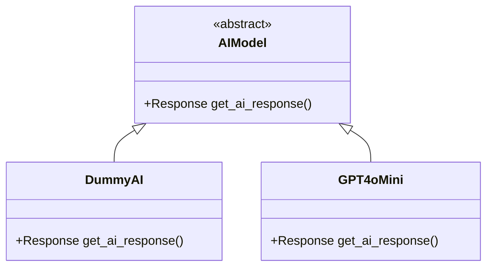

# AI Models

The `AIModel` defines an interface for communicating with and getting a response with an AI model.

```mermaid
classDiagram
    class AIModel
    
    AIModel <|-- DummyAI
    AIModel <|-- GPT4oMini
    
    <<abstract>> AIModel
    AIModel: +Response get_ai_response()
    
    class DummyAI
    DummyAI: +Response get_ai_response()
    
    class GPT4oMini
    GPT4oMini: +Response get_ai_response()
```